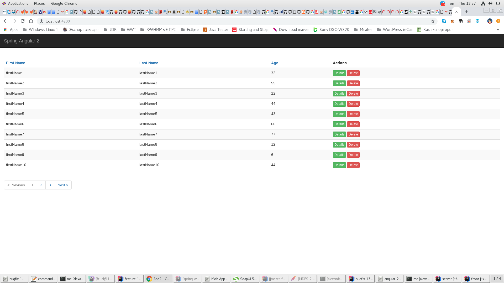
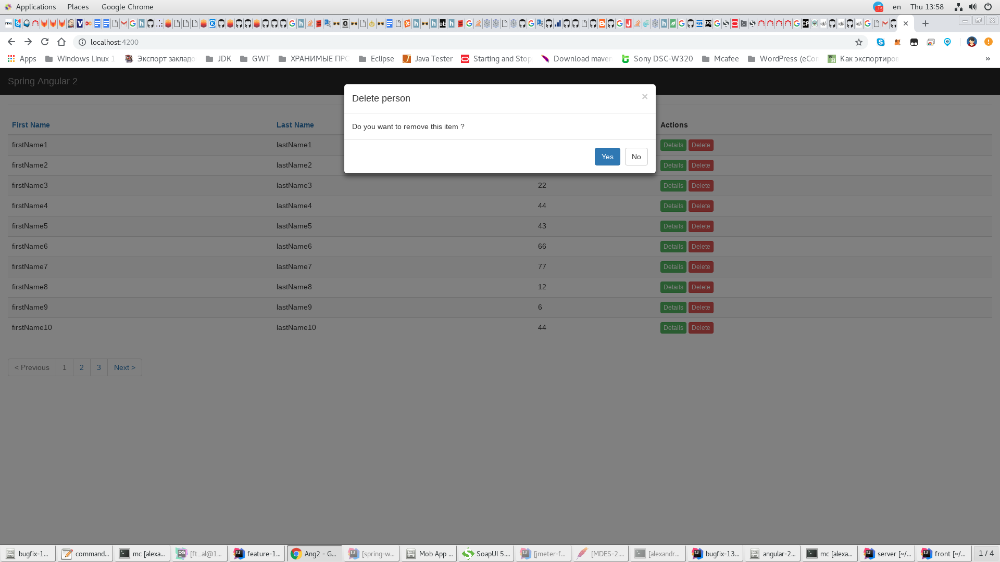
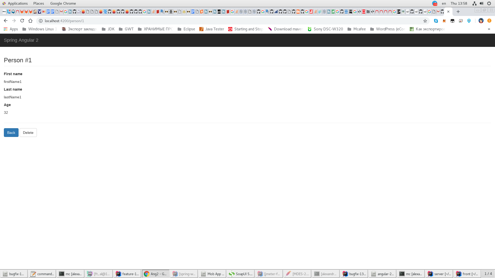
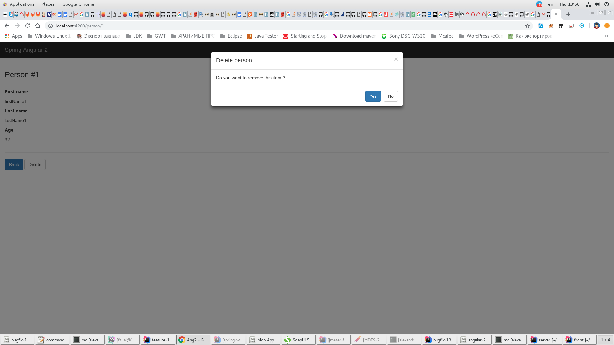

# Angular 2+ and Spring Boot Integration

### The Front End
* https://github.com/zouabimourad/angular2-spring
* [Ссылка на исходное описание проекта](https://www.quora.com/How-do-I-integrate-Angular-2-with-Spring-MVC) (который Не удалось запустить) [Angular2-SpringBoot-Example](https://github.com/rakshitshah94/Angular2-SpringBoot-Example)

## Installation
* Need
  * `node -v` **v10.16.0**
  * `npm -v` **6.9.0**
  * `ng version` **Angular CLI: 8.1.1**
* `npm install` to install Node packages
* `npm install -g @angular/cli` to install [Angular CLI](https://github.com/angular/angular-cli) ( globally - если уже установлен тогда не обязательно) 
* Default port **4200**

## Run
* NG Live Development Server `ng serve`.
* [http://localhost:4200](http://localhost:4200)
  

  
* [http://localhost:4200/person/1](http://localhost:4200/person/1)
  

  
