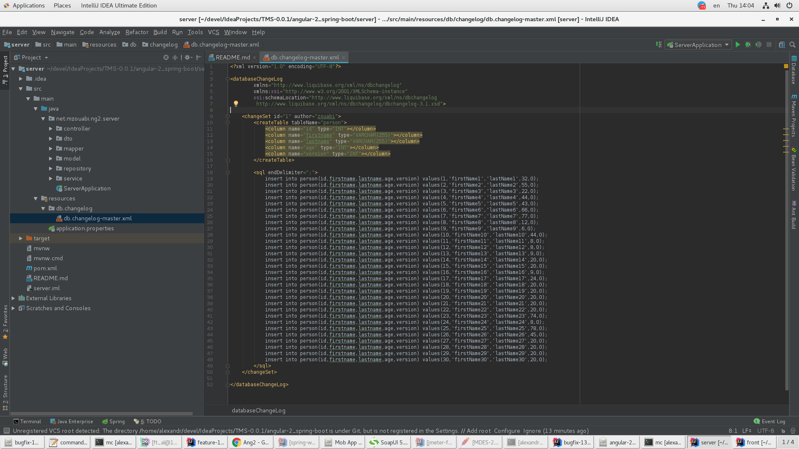

# Angular 2+ and Spring Boot Integration

### The Back End
* https://github.com/zouabimourad/angular2-spring
* [Ссылка на исходное описание проекта](https://www.quora.com/How-do-I-integrate-Angular-2-with-Spring-MVC) (который Не удалось запустить) [Angular2-SpringBoot-Example](https://github.com/rakshitshah94/Angular2-SpringBoot-Example)

## Installation
* Need
  * **Maven 3+**
  * **Java 8**
* Database **H2**
  * liquibase
    
* Default port **8080**

## Run
* Run Spring application `mvn spring-boot:run`.
* **(** [http://localhost:8080](http://localhost:8080) **)**
* [http://localhost:8080/api/person?size=10&page=0](http://localhost:8080/api/person?size=10&page=0)
  * Request Method **GET**
  * Response Body
    ```json
    {
      "content": [
        {
          "id": 1,
          "firstname": "firstName1",
          "lastname": "lastName1",
          "age": 32,
          "dateOfBirth": null
        },
        ...
        {
          "id": 10,
          "firstname": "firstName10",
          "lastname": "lastName10",
          "age": 44,
          "dateOfBirth": null
        }
      ],
      "last": false,
      "totalPages": 3,
      "totalElements": 30,
      "numberOfElements": 10,
      "sort": null,
      "first": true,
      "size": 10,
      "number": 0
    }
    ```
* [http://localhost:8080/api/person/1](http://localhost:8080/api/person/1)
  * Request Method **GET**
  * Response Body
    ```json
    {
      "id": 1,
      "firstname": "firstName1",
      "lastname": "lastName1",
      "age": 32,
      "dateOfBirth": null
    }
    ```
* [http://localhost:8080/api/person/1](http://localhost:8080/api/person/1)
  * Request Method **DELETE**

